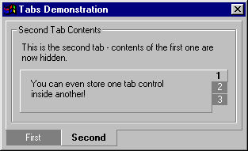



## Tabs Contol \- TabStrip replacement control

### Description

Using the TabStrip supplied by Microsoft, I soon realised I wasn't getting much value for the 1-Mb overhead needed by the common controls ActiveX. I also wanted the look and feel you see here, which I couldn't find elsewhere. I looked at other replacements for TabStrip, but they used quite a lot of resources (images, text boxes, etc) which all put a drain on Windows. This control just uses a totally empty control and draws on it. It's as simple as I could make it.

I also added a PropertyPage - I've not used them before but it was surprisingly straightforward. Very useful for administering the various tabs and their captions.

I didn't set out to create an all-singing all-dancing tabs control. This is a simple control which displays tabs in a particular way, and is flexible enough for many purposes. If you want more, extend it yourself! Enjoy!
 
### More Info
 

             |
---                |---
**Submitted On**   |2002-09-24 12:50:12
**By**             |[Nick Gisburne](https://github.com/Planet-Source-Code/PSCIndex/blob/master/ByAuthor/nick-gisburne.md)
**Level**          |Advanced
**User Rating**    |4.9 (123 globes from 25 users)
**Compatibility**  |VB 6\.0
**Category**       |[Custom Controls/ Forms/  Menus](https://github.com/Planet-Source-Code/PSCIndex/blob/master/ByCategory/custom-controls-forms-menus__1-4.md)
**World**          |[Visual Basic](https://github.com/Planet-Source-Code/PSCIndex/blob/master/ByWorld/visual-basic.md)
**Archive File**   |[Tabs\_Conto1355069242002\.zip](https://github.com/Planet-Source-Code/nick-gisburne-tabs-contol-tabstrip-replacement-control__1-39227/archive/master.zip)

